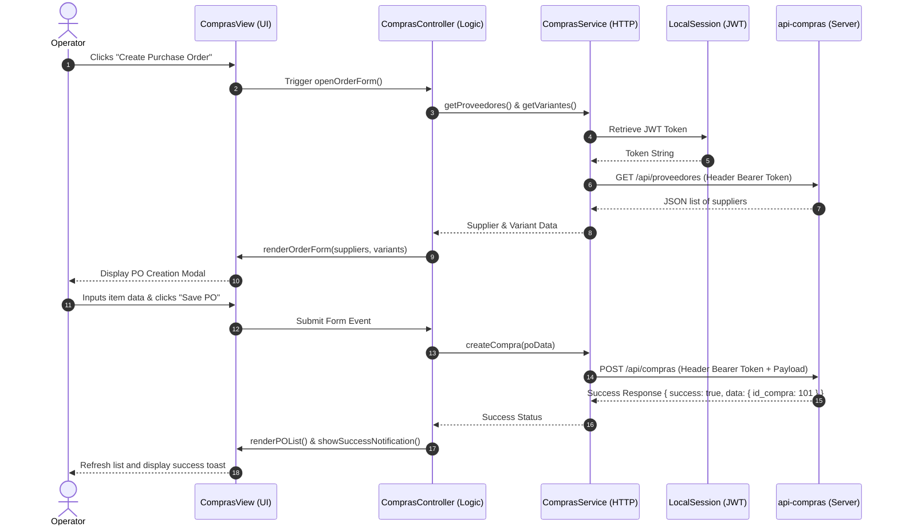

# Active Design Specification: Frontend Compras Page

## Feature Name
Implementation of the Compras (Purchases) module interface inside the frontend, integrating with the `api-compras` microservice and SSO authentication.

---

## Problem Statement
The ERP system requires a unified, responsive frontend interface for the Purchases (`compras`) workflow. The interface must allow users to manage suppliers, purchase orders, purchase receptions, and purchase returns. Because the architecture relies on distributed microservices and strict database isolation:
1. All requests must attach the central SSO JWT token.
2. The UI must coordinate validations of variants and warehouses with the inventory context.
3. The implementation must adhere strictly to the MVC design pattern (separating views, event controllers, and API clients).

---

## Scope

### Included:
1. **Supplier & City Management**:
   * View all suppliers and active cities.
   * Form to register a new supplier.
   * Form to edit an existing supplier's details.
2. **Purchase Orders (PO)**:
   * View list of POs with details and status badges (`ABI` Open, `APR` Approved, `ANU` Cancelled).
   * Create a new PO with dynamic line items (select supplier, add items with variant selection, quantity, and unit price; auto-calculate subtotals, IVA 12% or 15%, and total).
   * Actions to update PO status (approve/cancel).
3. **Purchase Receptions**:
   * View historical receptions.
   * Register a new reception for an approved PO (select warehouse, verify requested quantities, input received quantities, specify difference reason if mismatch exists).
   * Action to approve/finalize a reception.
4. **Purchase Returns**:
   * View historical returns.
   * Register a new return for a PO (select warehouse, input returned quantities, specify return reason).
   * Action to approve/finalize a return.
5. **API Services**:
   * Dedicated client layer to fetch/send data to `api-compras` routes with auto-injected JWT authorization headers.

### Excluded:
1. **Backend Route or Model Modification**: All backend microservice endpoints are assumed to be ready and functional as per the `api-compras-architecture.md` specification.
2. **Direct DB Connection**: No direct queries to PostgreSQL or Supabase from frontend files.

---

## Implementation Details

### 1. Component & MVC Architecture Design
The frontend will be built as a React SPA using the template under `frontend/plantilla/`. We organize the modules as follows:

```text
frontend/plantilla/src/app/compras/
├── page.tsx                       # Main Compras Dashboard (tabs coordinator)
├── components/
│   ├── proveedores-tab.tsx        # Suppliers management grid and form modal
│   ├── ordenes-tab.tsx            # Purchase orders list and order creator
│   ├── recepciones-tab.tsx        # Receptions tracking and registration
│   └── devoluciones-tab.tsx       # Returns management
├── services/
│   ├── compras-service.ts         # Encapsulated API calls to api-compras
│   └── inventario-service.ts      # Encapsulated API calls to api-inventario (for variants/warehouses)
└── hooks/
    └── use-compras.ts             # Custom hook for purchases state management
```


### 2. Interaction Sequence Diagram (Mermaid)



### 3. Service Layer Interface Contract (`comprasService`)
Every service call will extract the JWT token from the application storage and inject it into the `Authorization` header:

```javascript
// Example headers config
const getHeaders = () => ({
  'Content-Type': 'application/json',
  'Authorization': `Bearer ${localStorage.getItem('jwt_token')}`
});
```

*   **Suppliers**:
    *   `getProveedores()`: `GET /api/proveedores`
    *   `createProveedor(data)`: `POST /api/proveedores`
    *   `updateProveedor(id, data)`: `PUT /api/proveedores/:id`
*   **Cities**:
    *   `getCiudades()`: `GET /api/ciudades`
*   **Purchase Orders**:
    *   `getCompras()`: `GET /api/compras`
    *   `getCompraDetails(id)`: `GET /api/compras/:id`
    *   `createCompra(payload)`: `POST /api/compras`
    *   `updateCompraEstado(id, estado)`: `PUT /api/compras/:id/estado`
*   **Receptions**:
    *   `getRecepciones()`: `GET /api/recepciones`
    *   `createRecepcion(payload)`: `POST /api/recepciones`
    *   `aprobarRecepcion(id)`: `PUT /api/recepciones/:id/aprobar`
*   **Returns**:
    *   `getDevoluciones()`: `GET /api/devoluciones-compra`
    *   `createDevolucion(payload)`: `POST /api/devoluciones-compra`
    *   `aprobarDevolucion(id)`: `PUT /api/devoluciones-compra/:id/aprobar`

---

## Test Plan

1.  **Form Calculations**:
    *   Verify PO subtotal, IVA, and total calculate correctly when adding/removing items or changing quantities/unit prices.
    *   Assert that changing the tax select (12% vs 15% IVA) recalculates the final total dynamically.
2.  **API Client Mocking**:
    *   Test that all service layer functions send requests to the correct endpoints with the appropriate HTTP headers.
    *   Simulate authentication failures (HTTP 401/403) and verify that controllers handle them by redirecting to the sign-in view.
3.  **Validation Rules**:
    *   Assert form validation catches empty fields (e.g., negative quantities, missing supplier, missing variant).
    *   Assert that during reception registry, if `received_qty != requested_qty`, the "Motivation" field is required.

---

## Risks / Edge Cases

1.  **JWT Expiration**:
    *   *Risk*: A user is filling out a long purchase order, and their JWT token expires. When they click save, the request fails with a 401.
    *   *Mitigation*: Implement local form state autosave or gracefully handle the 401 by opening a re-authentication login modal without losing the entered form state.
2.  **Referencing Invalid Inventory Data**:
    *   *Risk*: When creating a PO or a reception, the UI displays variants or warehouses cached in memory that have since been deleted or deactivated in `api-inventario`.
    *   *Mitigation*: Fetch fresh variants and warehouses list from the inventory services every time the form is opened.
3.  **Partial Reception Stock Matching**:
    *   *Risk*: A reception receives partial items. How should subsequent receptions be registered for the remaining balance?
    *   *Mitigation*: During reception creation, check the sum of already received quantities for the PO and display the remaining balance as the target baseline.

---

## Resolved Design Decisions

1.  **Frontend Tech Stack Selection**:
    *   *Decision*: **React + Vite + TypeScript** (using `frontend/plantilla/src/`).
    *   *Justification*: Leverages the modern React SPA architecture already structured in the `main` branch, allowing modular hooks, reusable component tabs, and robust type safety.
2.  **Communication with `api-inventario`**:
    *   *Decision*: **Direct communication from the frontend client to the `api-inventario` endpoints** (using the shared JWT for authorization).
    *   *Justification*: More secure and performant. In a distributed microservices pattern, direct service communication avoids overhead bottlenecks and bloated endpoints in `api-compras`. Security is maintained because all services validate the same signed JWT locally.
3.  **User Roles & Access Control**:
    *   *Decision*: Restricted to the **Administrator** role for now.
    *   *Justification*: Simplifies initial permissions while ensuring only authorized admin users can create/approve orders, receptions, and returns.
4.  **Backend Base URL Configuration**:
    *   *Decision*: Loaded via **`import.meta.env.VITE_...`** variables in a local `.env` file.
    *   *Justification*: Standard for Vite-built client applications. Since the application runs in the browser, `process.env` is not natively available at runtime without bundling libraries. Vite compiles `import.meta.env` at build-time, which is clean, performant, and secure.

